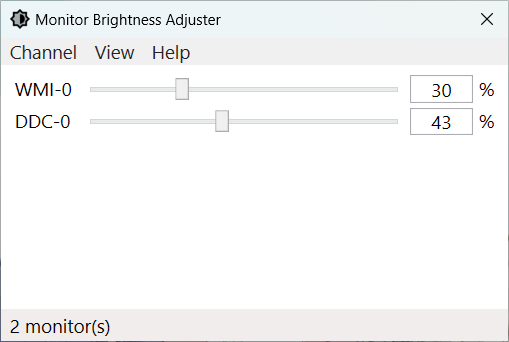

# 屏幕亮度调节器

🌍 **[English](README.md) | [简体中文](README-CN.md)**

屏幕亮度调节器是一款用来帮助您控制显示器屏幕亮度的小巧程序。无论您是在深夜工作还是需要微调显示亮度，该工具都提供了一种便捷的方式来调整亮度水平。

## 软件特性

- 支持调节多个屏幕的亮度
- 支持通过 WMI 和 DDC 协议调节屏幕的亮度（包括笔记本屏幕和外接显示器）

## 运行需求

- Windows 7 及以上操作系统
- .NET Framework 4.7.2 及以上版本框架

## 预览图片

## 开源许可

此项目根据 MIT 许可证授权，详见 [LICENSE](LICENSE.md) 文件。
